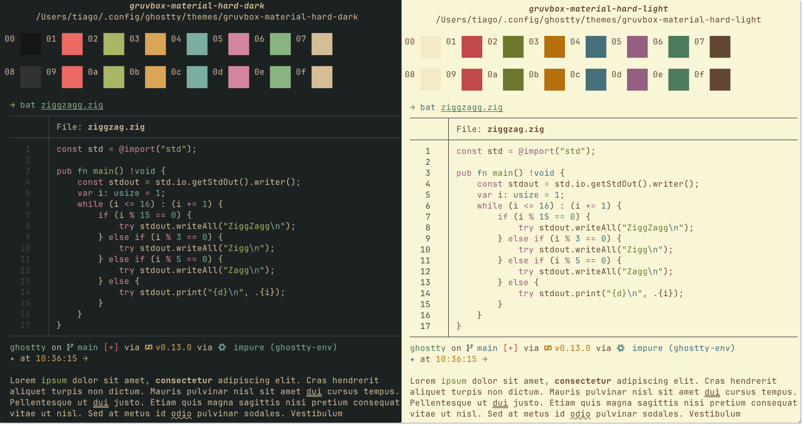

# Gruvbox Material for Ghostty



## How to load only Dark/Light:
```
theme = gruvbox-material-hard-dark
```

## How to load with Dark & Light mode:
```
theme = light:gruvbox-material-hard-light,dark:gruvbox-material-hard-dark
```

#### To use this theme simply copy the `/themes` folder contents of this repo into your `~/.config/ghostty/themes` directory.
